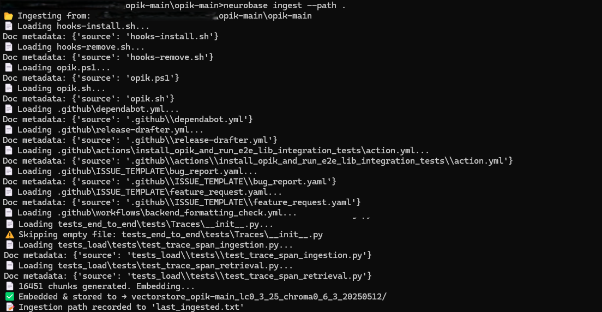
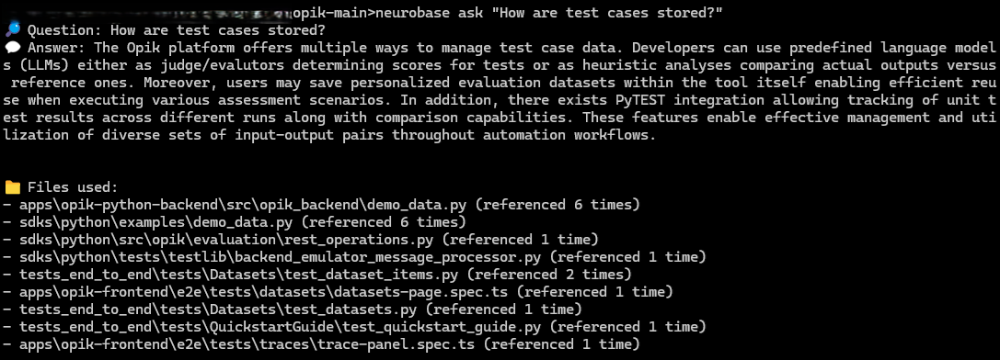

# 🧠 Neurobase — Simple Local AI for Your Codebase

**Neurobase** is a zero-setup, CLI-first AI assistant you run directly inside your codebase.  
Ask it questions about your own source files — powered by local embeddings + a local LLM served via Docker HuggingFace TGI Container.

---

## 🧰 Requirements

- ✅ Windows 11 or Linux with Docker + NVIDIA GPU
- ✅ Python 3.10+ (recommended via Conda)
- ✅ Docker + NVIDIA Container Toolkit
- ✅ Hugging Face account (for model downloads)

---

## 🚀 Quickstart

### 1. Clone + Setup Environment

```bash
git clone https://github.com/yourusername/neurobase
cd neurobase

# (Optional) Create and activate a Conda env
conda create -n neurobase python=3.10 -y
conda activate neurobase

# Install dependencies in editable mode (links CLI live)
pip install -e .
```

---

### 2. Run the LLM with Docker (Hugging Face TGI)

```bash
docker compose up --build
```

🧠 This starts `TheBloke/Mistral-7B-Instruct-v0.2-AWQ` served by **Text Generation Inference** on `http://localhost:8080`.

- ✅ Make sure your GPU is visible to Docker (`docker info` should show NVIDIA under `Runtimes`)
- ✅ Requires a one-time download of model weights (done automatically if TGI has `HUGGINGFACE_TOKEN` set)

---

### 3. Ingest Your Codebase

```bash
neurobase ingest --path .
```

Or to ingest another folder:

```bash
neurobase ingest --path ../some-other-repo
```

🗂️ This uses `ChromaDB` and `e5-base-v2` embeddings to build a searchable vector database of your code.

---

### 4. Ask Questions About the Codebase

```bash
neurobase ask "Which folders are excluded from ingestion?"
```

🧠 Answers are grounded in your actual source files via **RAG (Retrieval-Augmented Generation)** with LangChain.

---

## 💡 Features

- 🧠 Retrieval-Augmented Generation (RAG) powered by LangChain
- 🔍 Code-aware search with `e5-base-v2` embeddings + ChromaDB
- 🤖 Fast local LLM inference with Mistral-7B-Instruct via TGI
- 🔐 No cloud APIs — everything runs locally
- 🧩 Easily portable across projects

---


## 🧠 Example Queries

```bash
neurobase ask "Where is the config loaded?"
neurobase ask "What does the ingestion module do?"
neurobase ask "How are text files parsed and chunked?"
```

---

## ⚙️ Recommended Runtime Settings

**Docker Compose (`docker-compose.yml`)**

```yaml
services:
  tgi:
    image: ghcr.io/huggingface/text-generation-inference:latest
    ports:
      - "8080:80"
    volumes:
      - ./models:/data
    shm_size: '6gb'
    environment:
      MODEL_ID: TheBloke/Mistral-7B-Instruct-v0.2-AWQ
      MAX_TOTAL_TOKENS: 3072
      MAX_INPUT_LENGTH: 2048
      MAX_BATCH_TOTAL_TOKENS: 6144
      QUANTIZE: awq
    deploy:
      resources:
        reservations:
          devices:
            - driver: nvidia
              count: 1
              capabilities: [gpu]
```
---



## 🧠 Powered By

- [LangChain](https://github.com/hwchase17/langchain)
- [ChromaDB](https://www.trychroma.com/)
- [Hugging Face TGI](https://github.com/huggingface/text-generation-inference)
- [Mistral-7B-Instruct v0.2 AWQ](https://huggingface.co/TheBloke/Mistral-7B-Instruct-v0.2-AWQ)

---